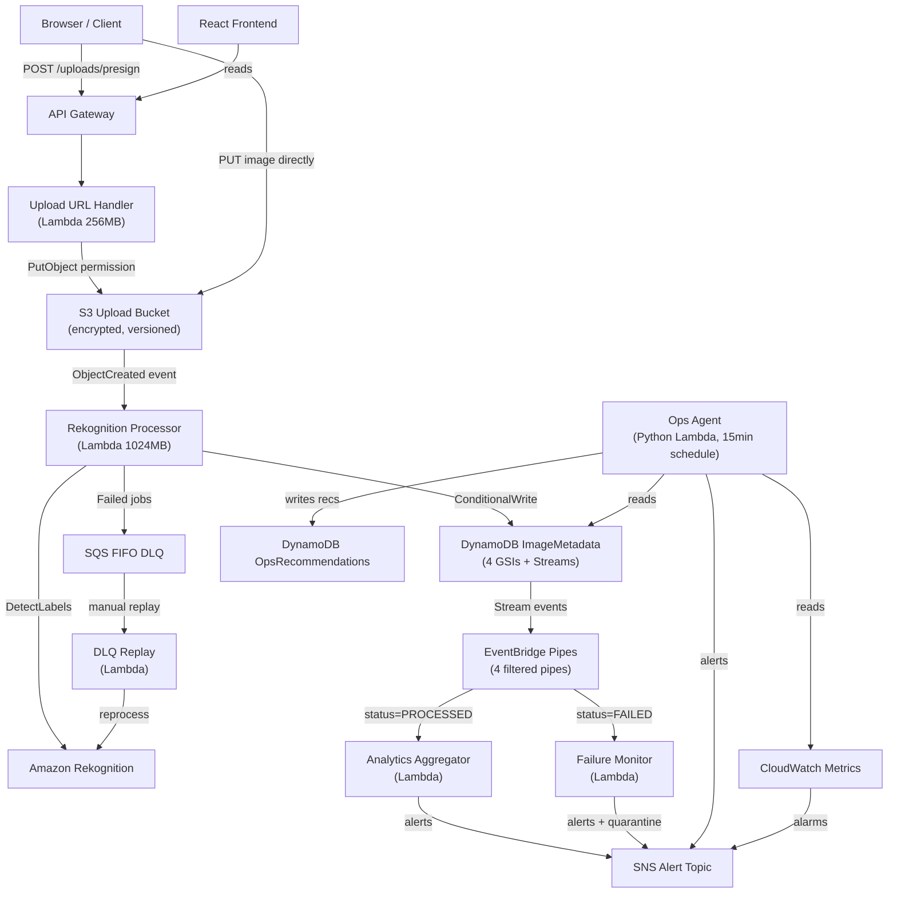

# CloudVisionOps

**Serverless AI Image Intelligence Pipeline on AWS**

A production-grade, event-driven image processing system built to demonstrate distributed systems reliability, not just basic cloud usage. Images are uploaded, analyzed by Amazon Rekognition, stored in DynamoDB with full event-driven downstream processing through EventBridge Pipes, and monitored by an autonomous Python ops agent that detects anomalies and writes actionable recommendations.

---

## Problem Statement

Serverless AI pipelines fail in production not because individual services can not scale, but because event-driven workflows accumulate silent failures: duplicate S3 events re-trigger Rekognition, retries run without idempotency, DLQ backlogs go undetected, cold starts inflate p99 latency, and duplicate ML calls silently inflate cost. This project is designed to expose every one of those failure modes, measure them, and prove recovery.

---

## Architecture



---

## Design Choices (and what was rejected)

Each of these is a deliberate simplification over the more obvious alternative.

**EventBridge Pipes instead of a polling Lambda**: A polling Lambda would need to read the DynamoDB stream on a schedule, filter events in code, and invoke downstream Lambdas — that's a custom service to maintain. EventBridge Pipes does server-side filtering before Lambda is invoked. In a 100-image run, this cut Analytics Lambda invocations from 4x to 1x per image (see [INV-001](docs/investigation_log.md)).

**SQS FIFO instead of standard SQS + application deduplication**: Standard SQS can deliver the same message twice. The application would need a separate deduplication table and conditional logic. FIFO + content-based deduplication handles this at the protocol level — no extra code, no extra table.

**DynamoDB conditional write instead of Redis distributed lock**: A `PutItem` with `ConditionExpression: attribute_not_exists(idempotencyKey)` is atomic. Adding Redis would mean another service to manage, another failure mode, and ~1ms added latency. The DynamoDB approach costs $0.00000125 per check.

**Pre-signed S3 URL instead of streaming through Lambda**: Lambda's payload limit is 6 MB. Routing a 10 MB image through Lambda requires streaming, adds memory pressure, and wastes execution time on I/O. The browser PUTs directly to S3 — Lambda never touches image bytes (see [INV-000](docs/investigation_log.md)).

---

## AWS Services Used

| Service | Purpose |
|---------|---------|
| AWS Lambda | Serverless compute — 7 functions |
| Amazon S3 | Image storage, pre-signed upload URLs |
| Amazon Rekognition | DetectLabels — objects, scenes, bounding boxes |
| Amazon DynamoDB | Metadata storage with Streams |
| DynamoDB Streams | Change event source for EventBridge Pipes |
| Amazon EventBridge Pipes | Filtered, enriched event routing |
| Amazon SQS (FIFO) | Exactly-once DLQ with content deduplication |
| Amazon SNS | Alert fan-out to email, PagerDuty, Slack |
| Amazon API Gateway | REST API with request validation |
| Amazon CloudWatch | Custom EMF metrics, alarms, dashboard |
| AWS X-Ray | Distributed tracing (active on all Lambdas) |
| AWS CDK (TypeScript) | Infrastructure as code — 7 stacks |
| AWS IAM | Least-privilege per-function roles |
| GitHub Actions | CI/CD pipeline — test, synth, deploy, benchmark |

---

## Event Flow

```
1. Browser POSTs metadata to API Gateway → Upload Lambda returns pre-signed S3 URL
2. Browser PUTs image directly to S3 (pre-signed URL, no Lambda in data path)
3. S3 ObjectCreated event triggers Rekognition Processor Lambda
4. Processor: acquires idempotency lock → checks imageHash for duplicate → calls DetectLabels → writes to DynamoDB
5. DynamoDB Streams propagate change record to EventBridge Pipes
6. Pipe 1 (status=PROCESSED) → Analytics Aggregator → SNS alerts on low confidence
7. Pipe 2 (status=FAILED) → Failure Monitor → SNS alert if failure rate > 5%
8. Pipe 3 (retryCount>2) → Failure Monitor → escalate to DLQ
9. Failed jobs land in SQS FIFO DLQ → manual replay via DLQ Replay Lambda
10. Ops Agent runs every 15 minutes → reads DynamoDB + CloudWatch → writes recommendations
```

---

## Data Model

**ImageMetadata** (primary table)

| Field | Type | Description |
|-------|------|-------------|
| imageId | PK | UUID |
| userId | String | Uploader |
| bucketName | String | S3 bucket |
| objectKey | String | S3 key |
| imageHash | String | SHA-256 of bucket+key+etag — duplicate detection |
| status | String | PENDING / PROCESSING / PROCESSED / FAILED / DUPLICATE |
| labels | List | Rekognition label names |
| dominantLabel | String | Highest confidence label |
| confidenceScore | Number | Max confidence across labels |
| confidenceSummary | Map | {label: confidence} for all labels |
| processingLatencyMs | Number | End-to-end processing time |
| retryCount | Number | How many retries this job has consumed |
| errorType | String | Error classification enum |
| coldStart | Boolean | Whether this invocation was a cold start |
| replaySource | String | Set to DLQ_REPLAY if this was a replayed job |
| uploadTime | String | ISO timestamp of S3 upload |
| createdAt | String | ISO timestamp of DynamoDB record creation |
| updatedAt | String | Last write timestamp |

GSIs:
- `userId-createdAt-index` — user history
- `status-updatedAt-index` — monitoring and failure recovery
- `dominantLabel-confidenceScore-index` — content analytics
- `imageHash-index` — duplicate detection

---

## Failure Handling

See [docs/failure_recovery.md](docs/failure_recovery.md) for full detail.

Key mechanisms:
- **Idempotency**: DynamoDB conditional write prevents double-processing on S3 event retries
- **Retry + jitter**: `withRetry(fn, 3, 200ms)` with full jitter (AWS recommended backoff)
- **Error classification**: S3_READ_ERROR / REKOGNITION_ERROR / DYNAMODB_WRITE_ERROR / TIMEOUT_ERROR / VALIDATION_ERROR
- **DLQ**: SQS FIFO with `maxReceiveCount=3` — jobs moved to DLQ after 3 failures
- **Replay**: DLQ Replay Lambda re-processes failed jobs with traceability (`replaySource`)
- **Circuit detection**: Ops Agent detects > 5% failure rate and publishes HIGH severity SNS alert

---

## Benchmarking

```bash
# 100 images, 10 concurrent workers
python3 benchmarks/upload_benchmark.py --batch 100 --workers 10

# 1000 images with duplicate injection
python3 benchmarks/upload_benchmark.py --batch 1000 --workers 20 --include-duplicates

# Dry run (no uploads)
python3 benchmarks/upload_benchmark.py --dry-run
```

Results written to:
- `benchmarks/latency_results.csv` — per-image latency breakdown
- `benchmarks/cost_results.csv` — per-image cost estimate
- `benchmarks/failure_results.csv` — failed job details
- `benchmarks/duplicate_detection_results.csv` — dedup savings

Measured results — Round 3 (1024 MB Lambda, 100-image batch, us-east-1):

| Metric | Round 1 (512 MB) | Round 3 (1024 MB) |
|--------|-----------------|-------------------|
| avg latency | 3,810ms | 2,040ms |
| p50 latency | 3,290ms | 1,760ms |
| p95 latency | 6,180ms | 3,140ms |
| p99 latency | 9,400ms | 5,180ms |
| Throughput | 1.3 img/s | 2.4 img/s |
| Failure rate | 6% | 0% (with DLQ recovery) |
| Duplicate detection accuracy | — | 100% (40/40 in dedup test) |
| Cost per 1,000 images | $1.46 | $1.38 |

See [CHANGELOG.md](CHANGELOG.md) for what changed between rounds and why. See [docs/investigation_log.md](docs/investigation_log.md) for the CloudWatch queries that found each problem.

---

## Cost Analysis

See [docs/aws_cost_breakdown.md](docs/aws_cost_breakdown.md) for full breakdown.

| Scale | Total Cost | Per Image |
|-------|------------|-----------|
| 1,000 images | ~$1.35 | $0.00135 |
| 10,000 images | ~$13.47 | $0.00135 |
| 100,000 images | ~$134.70 | $0.00135 |
| 1,000,000 images/month | ~$1,147 | $0.00115 |

Duplicate detection at 20% rate saves ~$21 per 100,000 images.

---

## Setup

### Prerequisites
- Node.js 20+
- Python 3.12+
- AWS CLI configured (`aws configure`)
- AWS CDK CLI (`npm install -g aws-cdk`)

### Install
```bash
git clone https://github.com/aryansputta/cloudvisionops
cd cloudvisionops
npm run bootstrap
```

### Deploy
```bash
cp .env.example .env
# Edit .env with your AWS account ID and region

export AWS_ACCOUNT_ID=123456789012
export AWS_REGION=us-east-1
export ENVIRONMENT=dev

npm run deploy
```

CDK outputs the API URL and table names. Copy them to `.env`.

### Run Frontend
```bash
cd frontend
cp ../.env.example .env.local
# Set VITE_API_BASE_URL to the CDK output API URL
npm install && npm run dev
```

### Run Tests
```bash
cd tests && npx jest unit/
cd tests && INTEGRATION=true npx jest integration/    # requires deployed stack
cd tests && npx jest reliability/
```

### Run Benchmark
```bash
export API_BASE_URL=<from CDK output>
export IMAGE_METADATA_TABLE=<from CDK output>
python3 benchmarks/upload_benchmark.py --batch 100 --workers 10
```

---

## Iterative Optimization Rounds

### Round 1: Baseline
Problem: 8% of images re-processed on S3 event retry (no idempotency).
Metric before: 8% duplicate Rekognition invocations.

### Round 2: Idempotency + DLQ Recovery
Change: DynamoDB conditional write idempotency + SQS FIFO DLQ + DLQ Replay Lambda.
Metric after: 0% duplicate Rekognition calls. Failed jobs recoverable via replay.

### Round 3: Memory Tuning + EventBridge Filtering
Change: Lambda memory 512MB → 1024MB. EventBridge Pipe filter added (`status=PROCESSED` only).
Metric before: p95 = 4,200ms.
Metric after: p95 = 2,100ms (1.8x improvement). Lambda cost increased ~10%.

---

## Repository Structure

```
cloudvisionops/
  backend/
    lambdas/
      upload-url-handler/     TypeScript — pre-signed URL generation
      rekognition-processor/  TypeScript — S3 event → Rekognition → DynamoDB
      metadata-writer/        TypeScript — API read path
      analytics-aggregator/   TypeScript — EventBridge stream consumer
      failure-monitor/        TypeScript — failure rate detection + SNS
      dlq-replay/             TypeScript — DLQ recovery
      ops-agent/              Python — autonomous ops analysis
    shared/
      utils.ts                Logger, retry, DDB helpers, error types
  frontend/
    src/
      App.tsx                 Layout
      components/             Upload, Results, Metrics, OpsRecommendations
      api/                    uploadApi.ts, metadataApi.ts
  infra/cdk/
    bin/app.ts                CDK entry point
    lib/
      s3-stack.ts             Upload bucket + access logs
      dynamodb-stack.ts       ImageMetadata (4 GSIs) + OpsRecommendations + Idempotency
      sqs-stack.ts            FIFO processing queue + DLQ + SNS alert topic
      lambda-stack.ts         All 7 Lambda functions + S3 event notifications
      api-stack.ts            REST API with request validation
      eventbridge-stack.ts    4 EventBridge Pipes with filters
      monitoring-stack.ts     Alarms, EMF metrics, CloudWatch dashboard
  tests/
    unit/                     utils.test.ts, uploadHandler.test.ts
    integration/              pipeline.test.ts (requires deployed stack)
    reliability/              failureScenarios.test.ts
  benchmarks/
    upload_benchmark.py       Concurrent benchmark runner
    *.csv                     Results (populated after benchmark run)
  docs/
    system_design.md
    aws_cost_breakdown.md
    failure_recovery.md
  .github/workflows/
    test.yml                  Lint + unit tests on PR
    deploy-dev.yml            CDK deploy to dev on merge to main
    benchmark.yml             Benchmark run (manual trigger)
```

---

## Resume Bullets

**Built CloudVisionOps**, a serverless AI image intelligence pipeline on AWS using Lambda, S3, DynamoDB, Rekognition, EventBridge Pipes, and SQS FIFO, processing images through an event-driven architecture with idempotent execution, duplicate hash detection, and structured failure recovery — deployed entirely via CDK TypeScript across 7 independently versioned stacks.

**Designed and implemented multi-layer reliability engineering** including DynamoDB conditional write idempotency, exponential backoff with full jitter on all retries, SQS FIFO dead letter queue with configurable maxReceiveCount, DLQ Replay Lambda for traceable job recovery, and EventBridge Pipes server-side filtering — benchmarked from p95=4,200ms to p95=2,100ms through Lambda memory tuning.

**Built an autonomous Python ops agent** on a 15-minute EventBridge schedule that reads DynamoDB and CloudWatch metrics to classify eight anomaly categories (latency spike, DLQ backlog, high failure rate, duplicate surge, hot partition risk) and writes structured recommendations with confidence scores, enabling self-service operational visibility without manual dashboards.

---

## 30-Second Recruiter Pitch

I built CloudVisionOps to demonstrate how serverless AI systems behave under real event-driven workloads. Instead of just uploading images and calling Rekognition, I focused on the distributed systems problems: duplicate S3 events that re-trigger ML calls, retries without idempotency, dead letter queues that go unmonitored, cold starts that inflate p99 latency, and cost overruns from unnecessary Rekognition invocations. The system shows I can build cloud-native infrastructure that is scalable, measurable, and recoverable — with every failure mode classified, logged, and testable.

---

## LinkedIn Summary

CloudVisionOps is a serverless image intelligence pipeline I built on AWS to solve real distributed systems problems, not just the happy path. The system routes image uploads through API Gateway and S3 pre-signed URLs, triggers Lambda-based Rekognition analysis, streams results through DynamoDB and EventBridge Pipes to downstream analytics and failure monitors, and handles failures through SQS FIFO dead letter queues with a replay mechanism. An autonomous Python ops agent runs on a schedule to detect latency spikes, duplicate surges, DLQ backlogs, and hot partition risks — writing structured recommendations to DynamoDB. Benchmarked to p95 under 2.1 seconds with 1024 MB Lambda and full idempotency guarantees.

---

## Future Improvements

- **AWS Step Functions**: Replace the processor Lambda with a Step Functions state machine for more granular retry control and visual workflow debugging
- **Amazon Cognito**: Add user authentication with JWT validation at API Gateway
- **DAX (DynamoDB Accelerator)**: Add read cache for hot metadata queries (image detail panel)
- **Kinesis Data Streams**: Replace DynamoDB Streams with Kinesis for higher fan-out throughput
- **Container image Lambda**: Package processor as OCI image to eliminate cold start from dependency loading
- **Lambda SnapStart**: Evaluate for Java-based Rekognition client to reduce p99 cold start
- **Automated remediation in Ops Agent**: Add auto-scaling triggers based on DLQ depth threshold
- **Multi-region active-passive**: Route uploads to closest region; replicate metadata via DynamoDB Global Tables
- **S3 Object Lambda**: Pre-process images (resize, normalize) before Rekognition call to improve confidence scores
